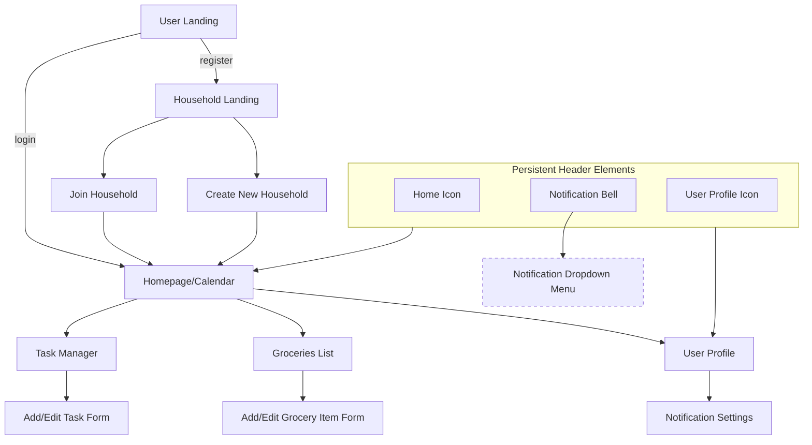
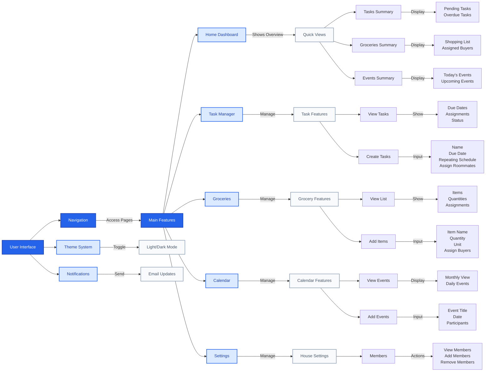

# RoomEase Architecture

# User V 0.5

```mermaid
graph TD
 A[User Landing] -->|login| G[Homepage/Calendar]
 A -->|register| D[Household Landing]
 D --> E[Join Household]
 D --> F[Create New Household]
 E --> G
 F --> G
 G --> I[Task Manager]
 G --> J[Groceries List]
 G --> K[User Profile]
 I --> L[Add/Edit Task Form]
 J --> M[Add/Edit Grocery Item Form]
 K --> N[Notification Settings]
 subgraph Header[Persistent Header Elements]
 O[Home Icon]
 P[Notification Bell]
 Q[User Profile Icon]
 end
 P --> R[Notification Dropdown Menu]
 Header --> G
 Header --> K
 style R stroke-dasharray: 5 5
```

# User V 1.0

```mermaid
graph LR
    %% Main Application
    UI[User Interface] --> NAV[Navigation]
    NAV --> |Access Pages| MAIN[Main Features]

    %% Main Features Section
    MAIN --> HOME[Home Dashboard]
    MAIN --> TASKS[Task Manager]
    MAIN --> GROC[Groceries]
    MAIN --> CAL[Calendar]
    MAIN --> SET[Settings]

    %% Home Dashboard Details
    HOME --> |Shows Overview| HOME1[Quick Views]
    HOME1 --> HOME1A[Tasks Summary]
    HOME1A --> |Display| HOME1A1[Pending Tasks<br/>Overdue Tasks]
    HOME1 --> HOME1B[Groceries Summary]
    HOME1B --> |Display| HOME1B1[Shopping List<br/>Assigned Buyers]
    HOME1 --> HOME1C[Events Summary]
    HOME1C --> |Display| HOME1C1[Today's Events<br/>Upcoming Events]

    %% Task Manager Details
    TASKS --> |Manage| TASKS1[Task Features]
    TASKS1 --> TASKS1A[View Tasks]
    TASKS1A --> |Show| TASKS1A1[Due Dates<br/>Assignments<br/>Status]
    TASKS1 --> TASKS1B[Create Tasks]
    TASKS1B --> |Input| TASKS1B1[Name<br/>Due Date<br/>Repeating Schedule<br/>Assign Roommates]

    %% Groceries Details
    GROC --> |Manage| GROC1[Grocery Features]
    GROC1 --> GROC1A[View List]
    GROC1A --> |Show| GROC1A1[Items<br/>Quantities<br/>Assignments]
    GROC1 --> GROC1B[Add Items]
    GROC1B --> |Input| GROC1B1[Item Name<br/>Quantity<br/>Unit<br/>Assign Buyers]

    %% Calendar Details
    CAL --> |Manage| CAL1[Calendar Features]
    CAL1 --> CAL1A[View Events]
    CAL1A --> |Display| CAL1A1[Monthly View<br/>Daily Events]
    CAL1 --> CAL1B[Add Events]
    CAL1B --> |Input| CAL1B1[Event Title<br/>Date<br/>Participants]

    %% Settings Details
    SET --> |Manage| SET1[House Settings]
    SET1 --> SET1A[Members]
    SET1A --> |Actions| SET1A1[View Members<br/>Add Members<br/>Remove Members]

    %% Theme System
    UI --> THEME[Theme System]
    THEME --> |Toggle| THEME1[Light/Dark Mode]

    %% Notifications
    UI --> NOTIF[Notifications]
    NOTIF --> |Send| NOTIF1[Email Updates]

    classDef primary fill:#2563eb,stroke:#1e40af,stroke-width:2px,color:white;
    classDef secondary fill:#dbeafe,stroke:#2563eb,stroke-width:2px,color:#1e40af;
    classDef tertiary fill:#f8fafc,stroke:#94a3b8,stroke-width:2px,color:#475569;

    class UI,NAV,MAIN primary;
    class HOME,TASKS,GROC,CAL,SET,THEME,NOTIF secondary;
    class HOME1,TASKS1,GROC1,CAL1,SET1,THEME1,NOTIF1 tertiary;
```

User will return to Home upon successfully adding/removing item.

# System V 1.0

```mermaid
flowchart TB
    %% Core Application Structure
    APP["index.html"] --> SCRIPT["script.js"]
    SCRIPT --> INIT["initializeApp()"]

    %% Main Module Managers
    INIT --> MM["Module Managers"]
    MM --> TM["TaskManager"]
    MM --> GM["GroceriesManager"]
    MM --> CM["CalendarManager"]
    MM --> HS["HouseSettings"]

    %% Database and Backend
    DB[("db.json")] --> DBS["Data Storage"]
    DBS --> DBS1["roomies[]"]
    DBS --> DBS2["groceries[]"]
    DBS --> DBS3["tasks[]"]
    DBS --> DBS4["events[]"]

    %% Monitor System
    MON["monitor.py"] --> DB
    MON --> EMAIL["Email Notifications"]

    %% Task Manager Implementation
    TM --> TM1["Task Management"]
    TM1 --> TMF["Functions"]
    TMF --> TMF1["fetchTasks()"]
    TMF --> TMF2["addTask()"]
    TMF --> TMF3["deleteTask()"]
    TMF --> TMF4["renderTaskManagerContent()"]
    TMF --> TMF5["toggleAddTaskForm()"]

    %% Groceries Manager Implementation
    GM --> GM1["Groceries Management"]
    GM1 --> GMF["Functions"]
    GMF --> GMF1["fetchGroceries()"]
    GMF --> GMF2["addGrocery()"]
    GMF --> GMF3["deleteGrocery()"]
    GMF --> GMF4["renderGroceriesManagerContent()"]

    %% Calendar Manager Implementation
    CM --> CM1["Calendar Management"]
    CM1 --> CMF["Functions"]
    CMF --> CMF1["fetchEvents()"]
    CMF --> CMF2["addEvent()"]
    CMF --> CMF3["deleteEvent()"]
    CMF --> CMF4["renderCalendarContent()"]
    CMF --> CMF5["getDaysInMonth()"]

    %% House Settings Implementation
    HS --> HS1["Settings Management"]
    HS1 --> HSF["Functions"]
    HSF --> HSF1["addRoomie()"]
    HSF --> HSF2["removeRoomie()"]
    HSF --> HSF3["renderHouseSettingsContent()"]

    %% API Communication
    TM1 & GM1 & CM1 & HS1 --> API["JSON Server API"]
    API --> DB

    %% Styling System
    STYLE["styles.css"] --> THEME["Theme System"]
    THEME --> THEME1["Light Mode"]
    THEME --> THEME2["Dark Mode"]
    THEME --> THEME3["System Preference Detection"]

    %% UI Components
    SHARED["Shared UI Components"] --> COMP["Components"]
    COMP --> COMP1["Tables"]
    COMP --> COMP2["Forms"]
    COMP --> COMP3["Cards"]
    COMP --> COMP4["Navigation"]

    %% Styling
    classDef core fill:#2563eb,stroke:#1e40af,stroke-width:2px,color:white
    classDef module fill:#dbeafe,stroke:#2563eb,stroke-width:2px,color:#1e40af
    classDef function fill:#f8fafc,stroke:#94a3b8,stroke-width:2px,color:#475569
    classDef database fill:#059669,stroke:#047857,stroke-width:2px,color:white

    class APP,SCRIPT,INIT core
    class TM,GM,CM,HS,STYLE module
    class TMF,GMF,CMF,HSF function
    class DB,API database
```
